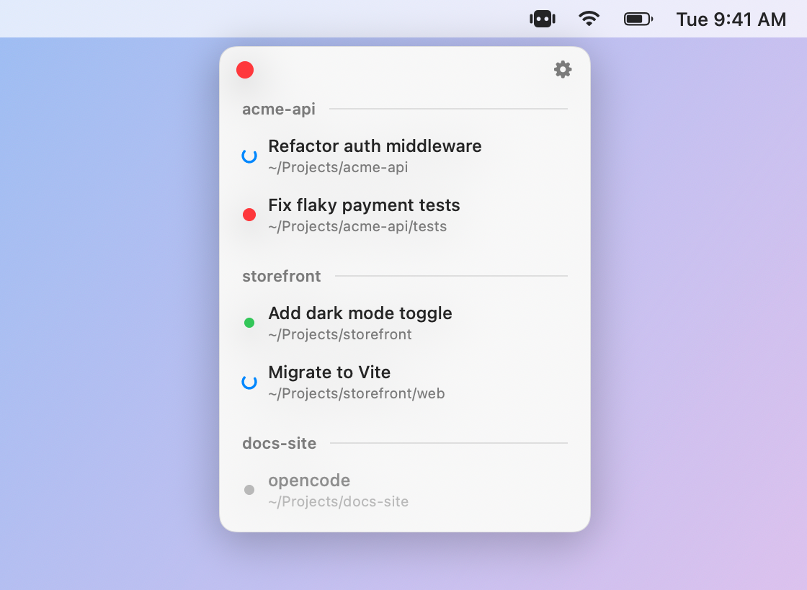

# Herdr Menu Bar

A macOS menu bar app that shows the live state of every agent in your
[Herdr](https://github.com/herdrdev/herdr) session. Click an agent to jump to its pane.

An unofficial companion app, not affiliated with the Herdr project.

<picture>
  <source media="(prefers-color-scheme: dark)" srcset="docs/screenshot-dark.png">
  
</picture>

## Features

- **Menu bar icon** that reflects the most urgent agent state: idle, working,
  waiting on you, or finished.
- **Dropdown** listing every agent, grouped by workspace in Herdr's order.
- **Click to jump**: focuses the agent's pane and brings its terminal to the
  front.
- **Notifications** when an agent needs you, with optional finish
  notifications, sound, and launch at login.

## Requirements

- macOS 14 or later
- Swift 5.10+ (Xcode or the Command Line Tools)
- A running Herdr session

## Install

```bash
./build.sh
cp -R "build/Herdr Menu Bar.app" /Applications/
open "/Applications/Herdr Menu Bar.app"
```

Run it from `/Applications`; macOS handles notifications differently for apps
elsewhere.

For clickable notifications on a local (unsigned) build, install
`terminal-notifier`:

```bash
brew install terminal-notifier
```

## Debugging

```bash
open --env HERDR_MENUBAR_DEBUG=1 "/Applications/Herdr Menu Bar.app"
tail -f ~/Library/Logs/HerdrMenuBar.log
```
